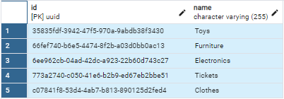
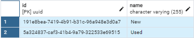
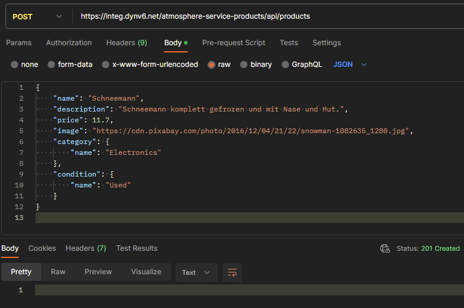

# AtmoSphere Service Search and Filtering

To facilitate an effective and user-friendly search mechanism that allows users to 
quickly and accurately find products they are interested in, thus improving user 
satisfaction and engagement on the platform.

Products are categorized into these categories (mandatory):


Products have conditions (mandatory):


## Getting Started
The base URL for the API backend is:
```
https://integ.dynv6.net/atmosphere-service-products/api
```
Get familiar with the API by reading the API documentation.

## API Documentation

The API documentation is provided by Swagger. 
To access the documentation, run the application and go to the following URL:
```
https://integ.dynv6.net/atmosphere-service-products/api/swagger-ui/index.html
```

The API Docs can be found here:
```
https://integ.dynv6.net/atmosphere-service-products/api/v3/api-docs
```

## Swagger UI
To view the API documentation as usual, follow these steps:
1. Call the API Docs (e.g. from Postman): https://integ.dynv6.net/atmosphere-service-products/api/v3/api-docs
2. Go to Swagger Editor: https://editor.swagger.io
3. Copy the response content of the API Docs into the Swagger Editor

## Example Requests

### Create a new product

#### cURL
```
curl --location 'https://integ.dynv6.net/atmosphere-service-products/api/products' \
--header 'Content-Type: application/json' \
--data '{
    "name": "Schneemann",
    "description": "Schneemann komplett gefroren und mit Nase und Hut.",
    "price": 11.7,
    "image": "https://cdn.pixabay.com/photo/2016/12/04/21/22/snowman-1882635_1280.jpg",
    "category": {
        "name": "Electronics"
    },
    "condition": {
        "name": "Used"
    }
}'
```

#### Postman


```
curl --location 'http://localhost:18080/api/search?search=Pro'
```
```
curl --location 'http://localhost:18080/api/search?search=&sortBy=price&sortOrder=DESC'
```
```
curl --location 'http://localhost:18080/api/filter?category=Electronics'
```
```
curl --location 'http://localhost:18080/api/filter?condition=Used'
```
```
curl --location 'http://localhost:18080/api/filter?fromPrice=40&toPrice=80'
```
```
curl --location 'http://localhost:18080/api/search/3d884170-adb8-4823-9819-e2570269d10d'
```

